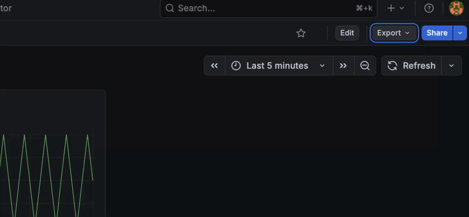

# Telegraf InfluxDB Grafana + Terraform Workbench
This Repository contains a basic TIG stack for experimenting with Grafana Terraform provider.

## Requirements
- terraform
- docker
- docker-compose

### OSX install
```Bash
sudo port install terraform colima docker docker-compose-plugin
```

### Dashboarding export
This procedure ensures to export a JSON version of the dashboard definition which is the most reusable one.

1. visually configure your board, then hit `export` button
2. Select `classic` model, and make sure that `Export for sharing externally` is selected

